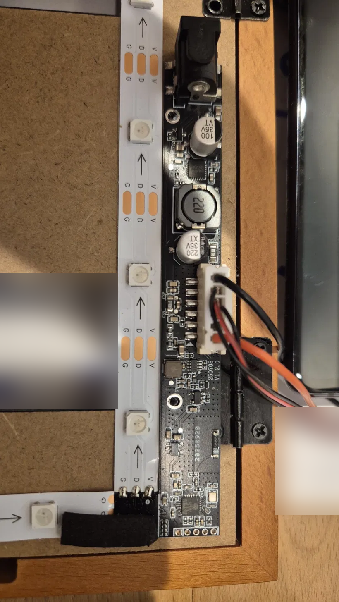
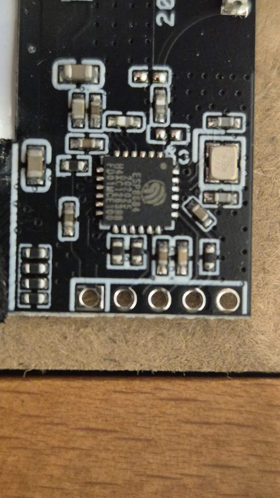

# iFramix iChargeGuard: local control with Tasmota

Replace the cloud firmware of the iFramix / iFramix Pro iChargeGuard wall-tablet charger with
[Tasmota](https://tasmota.github.io/), so the charger and its LED strip are
controlled locally over MQTT from Home Assistant, with no vendor cloud.

> **Disclaimer:** flashing third-party firmware voids any warranty and can brick
> the device. Back up the original flash first. You do this at your own risk.
> Not affiliated with iFramix.

## Why

The charger powers a wall tablet running WallPanel, showing Home Assistant
dashboards and photos from Immich albums. I wanted the charger and its LED
strip to work entirely locally, integrated with Home Assistant over my own
MQTT broker, without depending on the vendor's cloud service or app.

## Hardware

| Item | Detail |
| --- | --- |
| SoC | Espressif **ESP8684H4** = ESP32-C2 with 4 MB flash built into the chip (silicon ECO4) |
| Board | Marked `V1.2.0`, `250708` |
| Stock firmware | ESP-IDF v5.2.5 |
| LED strip | 26 x WS2812 |
| Programming header | 5 pads at the end of the board: 3V3, BOOT (GPIO9), TX, RX, GND |





### Pin map (from the stock firmware)

| GPIO | Function | Stock behaviour |
| --- | --- | --- |
| 0 | ADC: USB current | ADC1 channel 0 |
| 1 | ADC: USB voltage | ADC1 channel 1, through a /4 divider |
| 2 | Charging enable | 1 = charging on |
| 3 | WiFi status LED | Low = connected (active-low, inferred) |
| 4 | Bluetooth status LED | Low = a phone connected over BLE |
| 5 | MQTT status LED | Low = connected to the vendor's server |
| 6 | Charging LED | Always the opposite of GPIO2 |
| 7 | WS2812 data | SPI2 MOSI, 8 MHz, one SPI byte per LED bit |

How this was found, with Ghidra driven by Claude Code through GhidraMCP, is in
[docs/reverse-engineering.md](docs/reverse-engineering.md).

## Flashing

You need a 3.3 V USB-serial adapter. The 5-pad programming header is, from
left to right as in the close-up photo (square pad on the left):

| Pad | Signal | ESP32-C2 pin | Connect to adapter |
| --- | --- | --- | --- |
| 1 | 3V3 | - | 3V3 (never 5 V) |
| 2 | BOOT | GPIO9 | GND while powering up = download mode; leave open for normal boot |
| 3 | TX | GPIO20 (U0TXD) | RX |
| 4 | RX | GPIO19 (U0RXD) | TX |
| 5 | GND | - | GND |

TX and RX cross over: the board's TX goes to the adapter's RX. GPIO8 must be
high at boot (it normally is). Power the board from the adapter only if it can
supply 300-500 mA; otherwise flashing can fail partway through.

### Serial console (picocom)

Read the device at **74880 baud**. That is the rate used during the reverse
engineering, and the rate at which the chip's boot messages (`ESP-ROM:esp32c2...`,
`rst:`, `boot:`, `load:`) appear, because this board has a 26 MHz crystal:

```
picocom -b 74880 /dev/ttyUSB0
```

Exit with `Ctrl-A`, then `Ctrl-X`. Close picocom before running esptool; both
can't use the port at once. Once Tasmota is running, its serial console is at
115200 (`picocom -b 115200 /dev/ttyUSB0`), though you won't normally need it:
everything is configured over WiFi.

**1. Back up the original firmware.** Keep this file private: it contains the
vendor's copyrighted code.

```
esptool.py --chip esp32c2 --port /dev/ttyUSB0 read_flash 0x0 0x400000 stock.bin
```

**2. Flash Tasmota.** Use the **factory** image. The images from this project's
[Releases](https://github.com/fall88/iframix_local_ichargeguard/releases) are
unmodified Tasmota v15.6.0 builds, identical to the
[official release](https://github.com/arendst/Tasmota/releases/tag/v15.6.0).

```
esptool.py --chip esp32c2 --port /dev/ttyUSB0 erase_flash
esptool.py --chip esp32c2 --port /dev/ttyUSB0 write_flash 0x0 tasmota32c2.factory.bin
```

| File | Contains | Use |
| --- | --- | --- |
| `tasmota32c2.factory.bin` | Bootloader, partition table, app | First flash over serial |
| `tasmota32c2.bin` | App only | Later updates from Tasmota's web UI |

> **"Invalid image block, can't boot" in a reset loop** means the app-only
> `tasmota32c2.bin` was written at `0x0`. On the ESP32-C2, the bootloader must
> sit at `0x0`. Erase and write the factory image instead.

After a power cycle, Tasmota starts a `tasmota-XXXX` WiFi access point for setup.
Tested on this board: the release image boots and its access point comes up,
so the standard Tasmota C2 build works with the board's 26 MHz crystal.

**Back to stock** at any time:

```
esptool.py --chip esp32c2 --port /dev/ttyUSB0 write_flash 0x0 stock.bin
```

## Tasmota configuration

1. **Configuration -> Other -> Template:** paste [`tasmota/template.json`](tasmota/template.json)
   and tick **Activate**.
2. **Console:** run the commands in [`tasmota/setup-commands.txt`](tasmota/setup-commands.txt).
3. **Configuration -> MQTT:** point it at your own broker.

| GPIO | Tasmota function | Purpose |
| --- | --- | --- |
| 0 | ADC Range1 | USB current (mA) |
| 1 | ADC Range2 | USB voltage (mV) |
| 2 | Relay1 | Charging switch |
| 3 | LedLink_i | Blinks while WiFi or MQTT is down |
| 6 | Led1_i | Follows the relay |
| 7 | WS2812 | LED strip (`Pixels 26`) |

**Check on your unit:**

- LED polarity: if the GPIO6 LED is lit while the relay is off, change `320` to
  `288` in the template (for GPIO3, `576` to `544`).
- ADC: compare against a USB power meter and adjust the last number of each
  `AdcParam` command.
- If the strip stays dark, your Tasmota build lacks WS2812-over-SPI support for
  the ESP32-C2. The relay and ADC still work.

## Home Assistant

Add the **Tasmota** integration (the setup uses `SetOption19 0`). You get a
switch for charging (`POWER1`), a light for the LED strip (`POWER2`) and two ADC
sensors.

The charger can't tell the tablet's battery percentage: USB voltage stays around
5 V whatever the battery state. Take the level from the tablet itself, through
WallPanel's MQTT sensors or the HA Companion app, and let Home Assistant switch
the charger. [`homeassistant/automations.yaml`](homeassistant/automations.yaml)
keeps the tablet between 40 % and 80 %, with a safety net if the sensor stops
reporting.

**Battery care:** use the tablet's built-in charge limit if it has one, keep it
cool, and let it reach 100 % about once a month so its percentage reading stays
accurate.

## Repository layout

```
docs/reverse-engineering.md   Ghidra + GhidraMCP + Claude Code walkthrough
docs/photos/                  PCB photos (metadata removed)
tasmota/                      Template and console commands
homeassistant/                Charging automations
```

## License

MIT for everything in this repository; see [LICENSE](LICENSE). The Tasmota
images in the releases are GPL-3.0; their source is at
[arendst/Tasmota v15.6.0](https://github.com/arendst/Tasmota/tree/v15.6.0).
